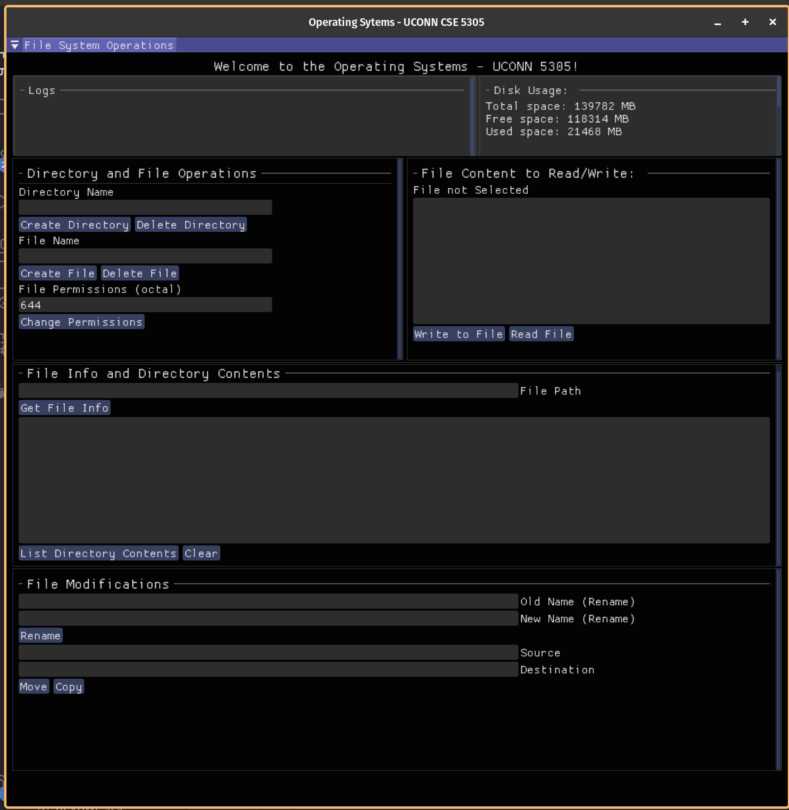
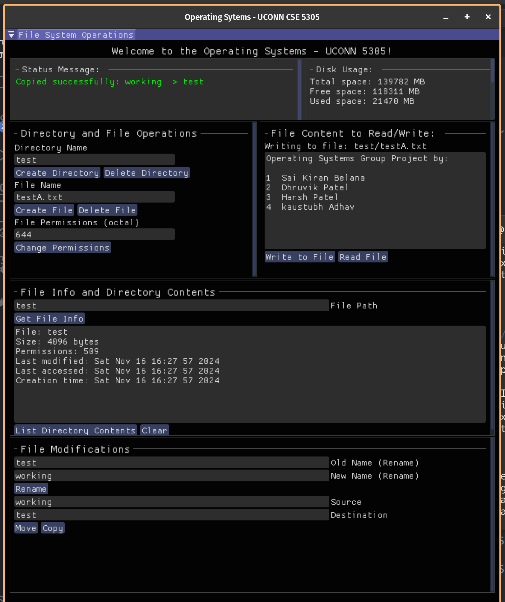

# OS-GroupProject

## File System using ImGUI

### Implemented Functions

| **Operation**            | **Function**                                                                 |
|---------------------------|-----------------------------------------------------------------------------|
| Create Directory          | `create_directory(dirName)`                                                |
| Delete Directory          | `delete_directory(dirName)`                                                |
| Create File               | `create_file(fileName)`                                                    |
| Delete File               | `delete_file(fileName)`                                                    |
| Write to File             | `write_to_file(fileName, fileContent.c_str())`                             |
| Read File                 | `read_file(fileName)`                                                      |
| Get File Info             | `get_file_info(filePath)`                                                  |
| List Directory Contents   | `list_directory_contents(filePath)`                                        |
| Rename File/Directory     | `rename_file_or_directory(oldName, newName)`                               |
| Move File/Directory       | `move_file_or_directory(moveCopySource, moveCopyDestination)`              |
| Copy File                 | `copy_file(moveCopySource, moveCopyDestination)`                          |
| Change File Permissions   | `change_permissions(fileName, parsedPermissions)`                         |
| Get Disk Usage            | `get_disk_usage(".")`                                                     |


### Steps to Build and Run the program. 


0. Install the necessary libraries

    ```bash
    sudo apt update
    sudo apt install gcc pkg-config g++ build-essential libglfw3-dev libgl1-mesa-dev libx11-dev libxrandr-dev libxi-dev libxxf86vm-dev libxcursor-dev cmake


1. Firstly, clone the ImGUI git repository into this project directory. We use the docking branch since it provides option to resize the windows according to our wish

    ```bash
    git clone --recursive https://github.com/ocornut/imgui -b docking
    ```
> NOTE: the `imgui` folder should be at ROOT i.e., one dir behind FileSys_GUI folder.


2. go to `file_system_gui` directory, and run the make command. 

    ```bash
    cd file_system_gui
    make
    ```

    > NOTE: Make sure, the make file IMGUI directory is pointed to the directory you cloned in step 1

3. Run the GUI interface:

    ```bash
    ./file_Sys_gui
    ```

### Diretory Structure for this project:

```bash
.
├── FileSys_GUI
├── imgui
├── Output_ScreenShots
└── README.md
```


### Test Screenshots:






### Terminal Based Test application 

Compilation and running steps:

    ```bash
    g++ tui.cpp -o tui 
    ./tui
    ```
